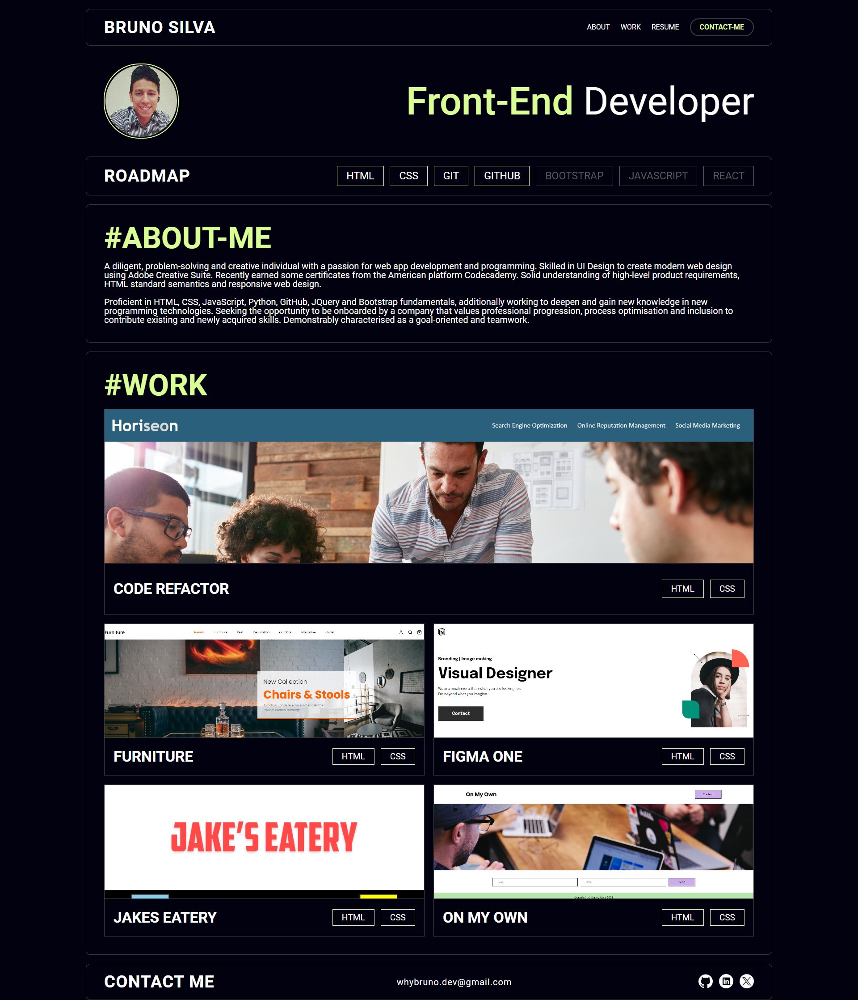
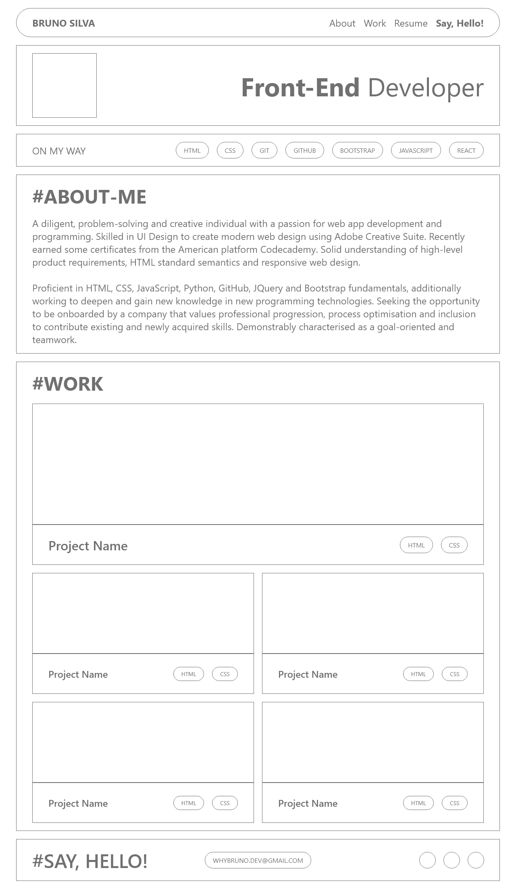

# :full_moon: About The Project

**Portfolio of Bruno** was designed by me from a clean wireframe artboard in Adobe Xd to be a responsive web design, following some acceptance criteria requested in this week's challenge at the **edX Front-End Web Development Bootcamp**.

# :waxing_gibbous_moon: Features

- HTML Semantic
- HTML Responsive Web Design

# :first_quarter_moon: Screenshot

# :waxing_crescent_moon: Acceptance Criteria

- Page presents your name, a recent photo.
- Page presents links to sections about you, your work, and how to contact you.
- Work section contains titled images of your applications.
- Your first application image should be larger in size than the others.
- Application image redirects to the deployed application after clicking.
- Layout is responsive and adapts to my viewport.

# :new_moon: Technologies

- HTML
- CSS
- JAVASCRIPT

# :globe_with_meridians: Website

- [Portfolio of Bruno](https://whybruno.github.io/portfolio-of-bruno)

# :copyright: Credits

- [W3Schools - Hamburger Menu Icon](https://www.w3schools.com/howto/howto_css_menu_icon.asp)
- [Bobbyhadz - addEventListener](https://bobbyhadz.com/blog/javascript-addeventlistener-is-not-a-function)

# :registered: License

MIT License